# QA/QC Jobs · 20 Defects · Test a Physical Product

- **Student's Name**: Dang Truong Nguyen
- **Student's ID**: 23127438

## Requirement 1: QA/QC Job Market 2026+

My TopCV Account Screenshot:
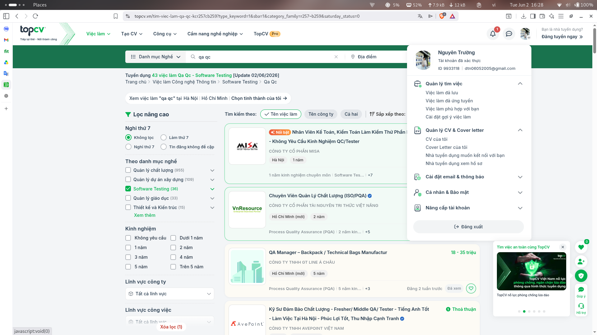

#### Job 1: QA Manager – Backpack / Technical Bags Manufactur

- __Link__: https://www.topcv.vn/viec-lam/qa-manager-backpack-technical-bags-manufactur/2068986.html?ta_source=JobSearchList_LinkDetail&u_sr_id=rc5D05IKKmdrvc15d76tb00SvY7O4F6I3kjwAiI2_1780389960
- **Dated**: 17/06/2026
- **Screenshot**:
   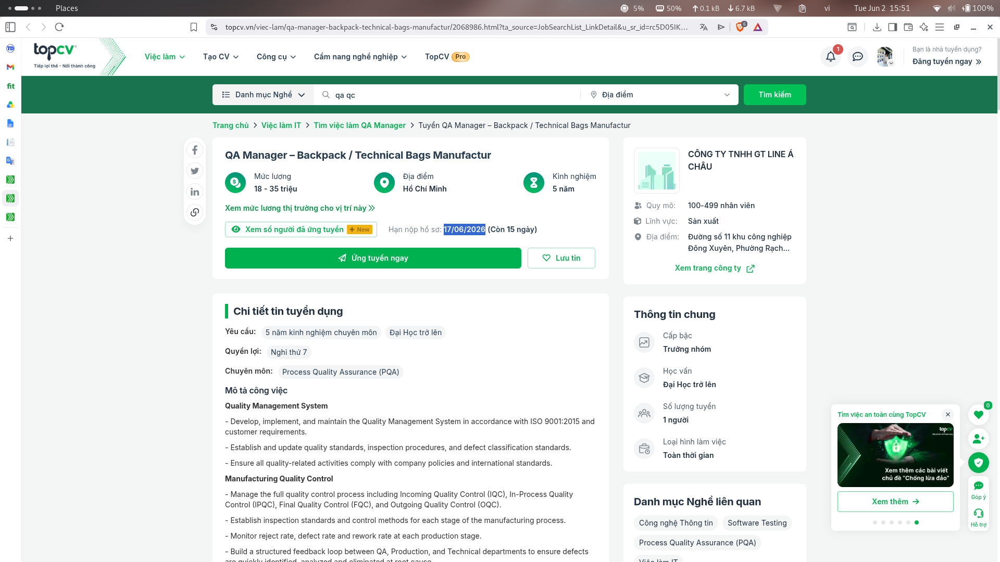
- **Job description**:

   - Quality Management System

      - Develop, implement, and maintain the Quality Management System in accordance with ISO 9001:2015 and customer requirements.
      - Establish and update quality standards, inspection procedures, and defect classification standards.
      - Ensure all quality-related activities comply with company policies and international standards.

   - Manufacturing Quality Control

      - Manage the full quality control process including Incoming Quality Control (IQC), In-Process Quality Control (IPQC), Final Quality Control (FQC), and Outgoing Quality Control (OQC).
      - Establish inspection standards and control methods for each stage of the manufacturing process.
      - Monitor reject rate, defect rate and rework rate at each production stage.
      - Build a structured feedback loop between QA, Production, and Technical departments to ensure defects are quickly identified, analyzed and eliminated at root cause.
      - Lead systematic improvements to reduce recurring defects and improve process stability.
      - Work closely with Production and Technical departments to continuously improve process capability and product quality.

   - Quality Data Analysis and Continuous Improvement

      - Monitor and analyze quality data to identify defect trends.
      - Lead continuous improvement initiatives and Kaizen projects focused on defect reduction and process optimization.
      - Drive cross‐functional improvement projects involving Production, Technical, IE, and Purchasing teams.
      - Apply quality tools such as 7 QC Tools, Root Cause Analysis, and CAPA.

   - Cost Reduction and Efficiency Improvement

      - Identify opportunities for cost saving through defect reduction, scrap reduction, rework elimination, and process improvement.
      - Lead quality-driven cost reduction projects in cooperation with Production, IE, and Technical departments.
      - Monitor quality-related cost such as scrap, rework, repair and customer claims.
      - Contribute to improving production efficiency and reducing cost of poor quality (COPQ).

   - Customer Quality Management

      - Manage customer complaints and quality alerts.
      - Conduct root cause analysis using methods such as 5 Why, Fishbone, or 8D.
      - Implement and track corrective and preventive actions to prevent recurrence.

   - Supplier Quality Management

      - Evaluate and monitor the quality performance of raw material suppliers.
      - Collaborate with the Purchasing department to improve supplier quality and consistency.
      - Develop supplier quality improvement plans when necessary.

   - New Product Introduction (NPI)

      - Work with Technical, R&D, and Production teams to define quality standards for new products.
      - Participate in pilot runs, first article inspections, and production readiness verification before mass production.

   - Internal and External Audits

      - Organize internal quality audits.
      - Prepare and coordinate customer audits and third-party certification audits.
      - Ensure the factory is always audit-ready.

   - Team Leadership

      - Lead, train, and develop the QA/QC team.
      - Improve quality awareness and inspection capability across the factory.
      - Promote a strong quality culture and continuous improvement mindset within the organization.

   - Key Quality KPIs

      - Reduce internal defect rate and reject rate.
      - Control customer complaint rate.
      - Improve First Pass Yield (FPY).
      - Reduce supplier defect rate.
      - Achieve measurable improvements through Kaizen and cost reduction projects.
      - Reduce Cost of Poor Quality (COPQ).

- **Required skills**:

   - Bachelor’s degree in Industrial Engineering, Garment Technology, Quality Management, or related fields.
   - Minimum 5 years of experience in quality management within a manufacturing environment.
   - Experience in backpack, bag, luggage, or garment industry is preferred.
   - Experience managing QA/QC teams.
   - Strong experience in continuous improvement, Kaizen, Lean manufacturing, or cost reduction initiatives.
   - Good understanding of ISO 9001:2015 and quality management tools.
   - Strong Excel and data analysis skills.
   - Ability to communicate in English.
   - Strong leadership, analytical, and problem-solving skills.

- **Salary**: 18,000,000 – 35,000,000 VND (negotiable depending on experience).
- **AI Impact Analysis**: AI-powered defect prediction and automated visual inspection systems are reducing manual QC checks, but this role&#39;s focus on ISO compliance, supplier auditing, and cross-functional leadership remains resilient. AI serves as a force multiplier for data analysis and KPI tracking rather than a replacement.

#### Job 2: Lead QA/QC (Exp AI)

- **Link**: https://www.topcv.vn/viec-lam/lead-qa-qc-exp-ai/2169227.html
- **Dated**: 18/06/2026
- __Screenshot__: 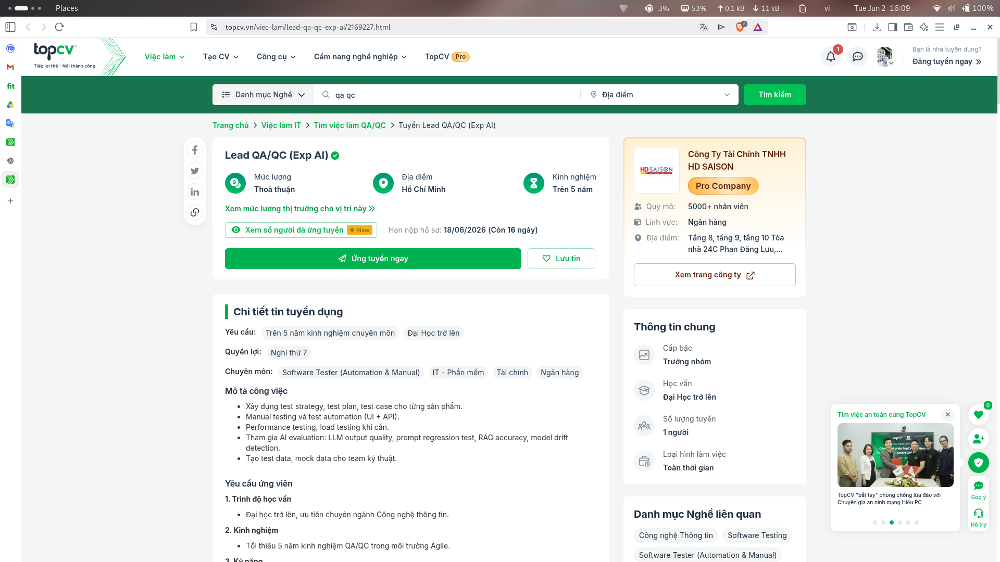
- **Job description**:

   - AI Evaluation & Quality

      - Participate in AI evaluation: LLM output quality, prompt regression test, RAG accuracy, model drift detection.
      - Create test data and mock data for the technical team.

   - Test Strategy & Execution

      - Build test strategy, test plan, and test cases for each product.
      - Manual testing and test automation (UI + API).
      - Performance testing and load testing when needed.

- **Required skills**:

   - Bachelor's degree or higher, preferably in Information Technology.
   - Minimum 5 years of QA/QC experience in an Agile environment.
   - Manual testing: writing test cases, test plans, exploratory testing.
   - API testing: Postman, REST Assured, or equivalent.
   - Basic SQL for data verification.
   - Test management tools: Jira, TestRail.
   - Must use AI tools for testing: Cursor, GitHub Copilot, Claude/ChatGPT to generate test cases, test data, and test scripts. Must be able to demo the workflow.
   - Knowledge or experience with LLM evaluation frameworks: DeepEval, Ragas, LangSmith, Promptfoo is a plus.
   - Transition roadmap: ready to transition to AI Quality Engineer / LLM Evaluation Engineer within 12-18 months.
   - Experience in Test Automation (Selenium/Playwright/Cypress) or Performance Test (JMeter/Locust/k6) is a plus.
   - Have participated in ML/AI projects in any field (test model, evaluate LLM output, validate data pipeline, A/B test for AI features, etc.) is a plus.
   - Meticulous, critical thinking, knows how to ask the right questions.
   - Able to read and understand English documentation.

- **Salary**: Negotiable
- **AI Impact Analysis**: This role explicitly requires AI tool proficiency (Cursor, Copilot, LLM evaluation frameworks), positioning it at the forefront of AI-driven QA. The job itself is adapting to include AI evaluation as a core competency rather than an auxiliary skill.

#### Job 3: Senior QC Engineer - Warehouse

- **Link**: https://www.topcv.vn/viec-lam/senior-qc-engineer-warehouse/2182447.html
- **Dated**: 28/06/2026
- __Screenshot__: 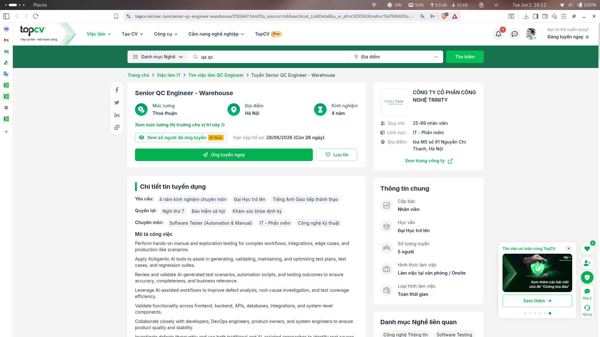
- **Job description**:

   - Manual & AI-Assisted Testing

      - Perform hands-on manual and exploration testing for complex workflows, integrations, edge cases, and production-like scenarios.
      - Apply AI/Agentic AI tools to assist in generating, validating, maintaining, and optimizing test plans, test cases, and regression suites.
      - Review and validate AI-generated test scenarios, automation scripts, and testing outcomes to ensure accuracy, completeness, and business relevance.
      - Leverage AI-assisted workflows to improve defect analysis, root-cause investigation, and test coverage efficiency.

   - Multi-Layer Validation

      - Validate functionality across frontend, backend, APIs, databases, integrations, and system-level components.
      - Collaborate closely with developers, DevOps engineers, product owners, and system engineers to ensure product quality and stability.
      - Investigate defects thoroughly and use both traditional and AI-assisted approaches to identify root causes and quality risks.

   - Test Automation & CI/CD

      - Develop and maintain automated test scripts/frameworks for regression, smoke, API, and integration testing.
      - Continuously identify repetitive manual testing activities and transform them into scalable automated or AI-assisted testing workflows.
      - Support CI/CD pipelines and integrate automated testing into deployment workflows.
      - Participate in performance, reliability, stress, and scalability testing activities.

   - AI Innovation & Process Improvement

      - Evaluate and experiment with emerging AI testing tools, AI agents, and QA productivity solutions to improve engineering efficiency.
      - Monitor testing metrics, defect trends, and release quality indicators using data-driven approaches.
      - Continuously improve QA processes, testing strategies, and AI-driven quality engineering practices.

- **Required skills**:

   - 4+ years of experience in software testing with strong manual testing expertise.
   - Experience testing complex, distributed, or high-traffic applications/systems.
   - Strong understanding of end-to-end testing, integration testing, regression testing, and exploratory testing.
   - Hands-on experience with automation testing tools/frameworks such as Selenium, Playwright, Cypress, Robot Framework, or similar.
   - Ability to write and maintain automation scripts using JavaScript, Java, Python, or similar languages.
   - Experience with API testing and backend validation.
   - Familiarity with Agile/Scrum methodologies and CI/CD environments.
   - Strong interest in applying AI/LLM/Agentic AI tools to improve software testing and QA workflows.
   - Experience using AI-assisted development/testing tools such as Cursor, Claude, GitHub Copilot, ChatGPT, or similar platforms is highly preferred.
   - Experience with test management and defect tracking tools such as Jira, qTest, Xray, or TestRail.
   - Strong analytical thinking, troubleshooting, and communication skills.
   - Ability to work independently in fast-paced and complex environments.

- **Salary**: Negotiable
- **AI Impact Analysis**: AI/Agentic AI tools are embedded into every phase of testing — from test generation to defect analysis — making this role a hybrid of traditional QC and AI prompt engineering. The demand for engineers who can validate AI outputs and red-team AI systems is growing rapidly.

#### Job 4: Senior QC (Automation)

- **Link**: https://www.topcv.vn/viec-lam/senior-qc-automation/2167401.html
- **Dated**: 17/06/2026
- __Screenshot__: 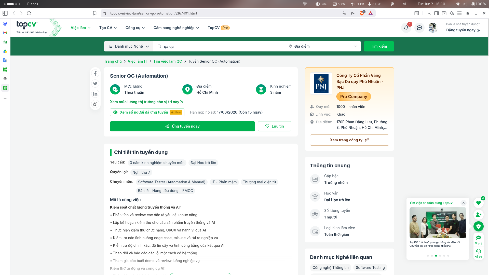
- **Job description**:

   - Traditional & AI Quality Control

      - Analyze and review functional requirement specifications.
      - Create test plans for both traditional and AI products.
      - Perform functional testing, UI/UX testing, and AI behavior testing.
      - Check edge cases, misuse scenarios, and business risks.
      - Verify accuracy, reliability, and fairness of AI outputs.
      - Track and report defects systematically.

   - Test Automation & AI Tools

      - Develop automated test scenarios.
      - Apply AI testing tools (LLM evaluation, synthetic data).
      - Set up and maintain CI/CD systems for testing.
      - Use user simulation tools for automated testing.
      - Develop internal tools to support AI testing.

   - AI Data Quality Assurance

      - Check completeness and accuracy of AI training data.
      - Evaluate diversity and balance of data.
      - Verify personal data processing and security compliance.
      - Monitor AI model performance over time.

- **Required skills**:

   - Bachelor's degree or higher in Computer Science, Information Technology, or related fields.
   - Minimum 3-4 years of experience in Software Testing Automation with AI applied in testing.
   - Proactive, dynamic, highly responsible, goal-oriented.
   - Ability to handle multiple projects simultaneously and prioritize according to schedule.
   - End-user mindset, careful in work.
   - Good communication, effective collaboration with related teams.
   - Ability to analyze system risks.
   - ISTQB, Agile certification or equivalent is a plus.

- **Salary**: Negotiable
- **AI Impact Analysis**: AI tools (LLM evaluation, synthetic data) are directly incorporated into the testing workflow, requiring the engineer to validate AI behavior alongside traditional functionality. This signals a shift where even automation-focused QC roles must now understand AI model risks and data fairness.

#### Job 5: Manual Test Engineer (Middle - Senior)

- **Link**: https://www.topcv.vn/viec-lam/manual-test-engineer-middle-senior/2158658.html
- **Dated**: 12/06/2026
- __Screenshot__: 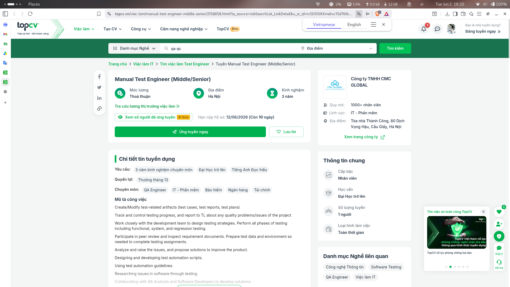
- **Job description**:

   - Create/Modify test-related artifacts (test cases, test reports, test plans).
   - Track and control testing progress, and report to TL about any quality problems/issues of the project.
   - Work closely with the development team to design testing strategies. Perform all phases of testing including functional, system, and regression testing.
   - Participate in peer review and inspect requirement documents. Prepare test data and environment as needed to complete testing assignments.
   - Analyze and raise the issues, and propose solutions to improve the product.
   - Designing and developing test automation scripts.
   - Using test automation guidelines.
   - Researching issues in software through testing.
   - Collaborating with QA Analysts and Software Developers to develop solutions.
   - Keeping updated with the latest industry developments.

- **Required skills**:

   - 3-4 years of experience working in Testing.
   - Experience in writing new test cases based on requirements.
   - Integration Test and develop test cases, and test plans.
   - Experience with tools such as Jmeter, Postman is preferred.
   - Have knowledge of Jira, Confluence/Wiki, Sharepoint, Excel, Postman, SQL.
   - Good knowledge of software development methodologies.
   - Experience on applying test techniques on Finance, Banking, Insurance projects.
   - Write test cases and report bugs clearly.
   - Proficiency in English.

- **Salary**: Negotiable
- **AI Impact Analysis**: Although titled "Manual Test," the role demands automation scripting and CI/CD integration, reflecting how AI-assisted test generation tools (Copilot, ChatGPT) are raising the baseline expectation even for manual testers. Pure manual testing without automation skills is becoming less viable.

#### Job 6: Software Testing Engineer - Manual Tester (Salary $700-$900)

- **Link**: https://www.topcv.vn/viec-lam/ky-su-kiem-thu-phan-mem-manual-tester-salary-700-900/2181996.html
- **Dated**: 29/06/2026
- __Screenshot__: 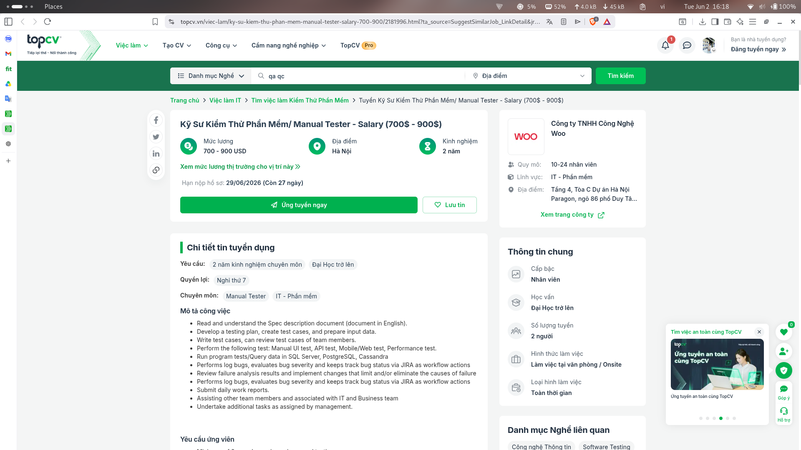
- **Job description**:

   - Read and understand the Spec description document (document in English).
   - Develop a testing plan, create test cases, and prepare input data.
   - Write test cases, can review test cases of team members.
   - Perform the following test: Manual UI test, API test, Mobile/Web test, Performance test.
   - Run program tests/Query data in SQL Server, PostgreSQL, Cassandra.
   - Performs log bugs, evaluates bug severity and keeps track bug status via JIRA as workflow actions.
   - Review failure analysis results and implement changes that limit and/or eliminate the causes of failure.
   - Submit daily work reports.
   - Assisting other team members and associated with IT and Business team.
   - Undertake additional tasks as assigned by management.

- **Required skills**:

   - Minimum of 2 years' experience in manual testing.
   - Ability to read, understand, and write test cases in English.
   - Detail-oriented and hardworking.

- **Salary**: $700 - $900
- **AI Impact Analysis**: This entry-level manual testing role has the least AI exposure, but AI-powered test case generators and low-code automation platforms are gradually reducing demand for pure manual testing. Upskilling toward automation or AI testing tools would be essential for long-term career growth.

#### Job 7: QA/QC Department Head (Mechanical Engineering, Automation) Thu Duc

- **Link**: https://www.topcv.vn/viec-lam/truong-phong-chat-luong-qa-qc-co-khi-tu-dong-hoa-thu-duc/2121904.html
- **Dated**: 15/06/2026
- __Screenshot__: 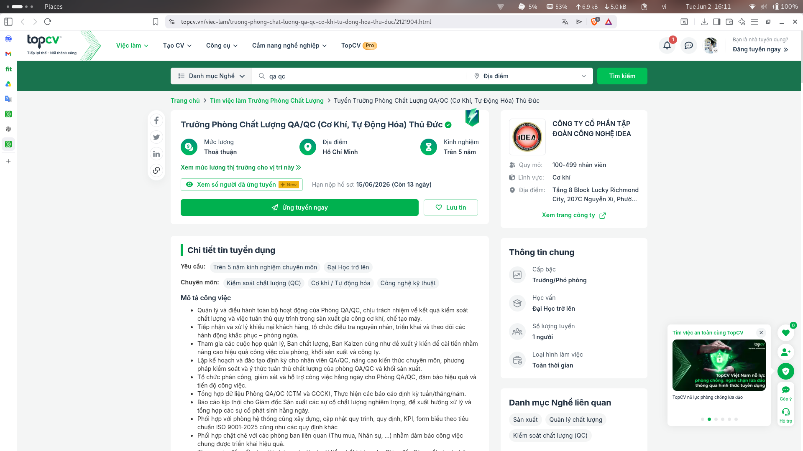
- **Job description**:

   - Quality Management System

      - Manage and oversee all activities of the QA/QC Department, responsible for quality control results and process compliance in mechanical processing and machine manufacturing production.
      - Coordinate with the system department to develop and update processes, regulations, KPIs, and forms according to ISO 9001-2025 standards.

   - Customer Complaint & Quality Incident Handling

      - Receive and handle customer complaints, organize root cause investigation, implement and monitor corrective and preventive actions.
      - Promptly report serious quality incidents to the Production Director.

   - Team Leadership & Training

      - Plan and conduct periodic training for QA/QC staff, enhancing professional knowledge, control methods, and quality compliance awareness.
      - Organize assignment, supervision, and daily work support for the QA/QC Department.

   - Reporting & Continuous Improvement

      - Consolidate QA/QC Department data (CTM and GCCK), prepare weekly/monthly/annual reports.
      - Participate in Quality Board and Kaizen meetings, propose improvement ideas to enhance work efficiency.
      - Closely coordinate with relevant departments (Purchasing, HR, etc.) to ensure effective implementation of common tasks.
      - Advise and propose management and quality improvement solutions to the Production Director.

- **Required skills**:

   - Bachelor's degree or higher in Mechanical Engineering, Manufacturing Engineering, Mechanical Design, Electrical - Automation, or related engineering fields.
   - Minimum 5 years of experience in QA/QC in a manufacturing plant, priority given to candidates with experience in mechanical processing and machine manufacturing.
   - Minimum 2 years of experience in a management position, Department Head or equivalent.
   - Language requirement: English.
   - Certified internal auditor for ISO 9001-2015, good understanding of ISO 14001-2015, IATF 16949-2016.
   - Completed internal auditor training and experience in audit sessions with ISO 9001-2015 certification bodies.
   - Proficient in the 7 QC tools, analysis, processing, and reporting of Non-Conformance Reports (NCR), customer complaints, and supplier evaluation.
   - Good communication skills, ability to connect, build team spirit, and develop staff within the QA/QC Department.

- **Salary**: Negotiable
- **AI Impact Analysis**: AI-driven predictive maintenance and computer vision are transforming mechanical QC, but this management role&#39;s emphasis on ISO systems, team leadership, and supplier coordination remains largely human-centric. AI augments data consolidation and reporting but does not replace the strategic oversight this position requires.

#### Job 8: QA Intern

- **Link**: https://www.topcv.vn/viec-lam/thuc-tap-sinh-qa/1649912.html
- **Dated**: 26/06/2026
- __Screenshot__: 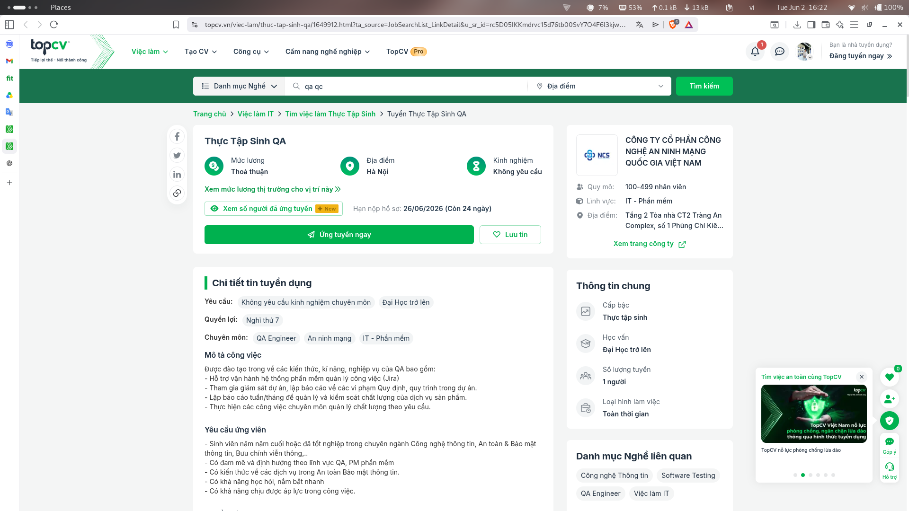
- **Job description**:

   - Receive training in QA knowledge, skills, and professional practices including:
   - Support the operation of the project management software system (Jira).
   - Participate in project monitoring, report on violations of regulations and processes within the project.
   - Prepare weekly/monthly reports to manage and control product service quality.
   - Perform professional quality management tasks as required.

- **Required skills**:

   - Final-year student or graduate in Information Technology, Information Security, or Telecommunications.
   - Passionate and oriented towards the QA and software PM field.
   - Knowledge of information security services.
   - Quick learning and grasping ability.
   - Ability to work under pressure.

- **Salary**: Negotiable
- **AI Impact Analysis**: As a junior entry point, this internship is less immediately affected by AI, though familiarity with AI-augmented test management tools is becoming a differentiator. The foundational QA process skills learned here will remain valuable as AI shifts the tester&#39;s role from execution to oversight.

#### Job 9: Quality Assurance (SaaS)

- **Link**: https://www.topcv.vn/viec-lam/quality-assurance-saas/2151608.html
- **Dated**: 01/07/2026
- __Screenshot__: 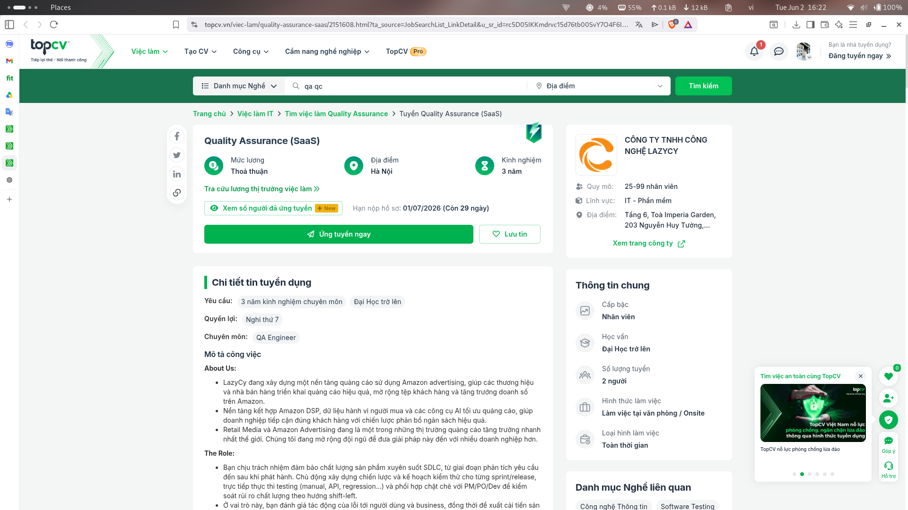
- **Job description**:

   - Proactively build overall test plans for each sprint/release according to the product roadmap.
   - Review requirements, assess product quality risks.
   - Design, standardize, and manage Test Plan, Test Scenario, Test Case, Checklist.
   - Directly execute testing (Manual, API, Regression...).
   - Closely coordinate with PM/PO/Dev to control quality risks following a shift-left approach.
   - Evaluate the impact of bugs on users and business, propose product and testing process improvements based on data.
   - Provide timely quality reports.

- **Required skills**:

   - 3-5 years of QA experience, priority given to SaaS products.
   - Deep understanding of software testing processes, SDLC, Agile/Scrum.
   - Ability to independently plan tests, design test cases, execute testing, manage bugs, and produce test reports.
   - Proficient in testing support tools (Postman, bug/test management tools).
   - Knowledge of API testing, performance testing, regression testing.
   - Ability to assess bug severity and impact on users and business.
   - Priority given to candidates with knowledge of Customer Experience (CX), UX/UI, UX Research.
   - Priority given to IT background or technical foundation.
   - Strong analytical & problem-solving skills, critical thinking.
   - Clear communication, effective collaboration with multiple stakeholders.
   - Proactive learner, keeps up with new testing knowledge and trends.

- **Salary**: Negotiable
- **AI Impact Analysis**: Operating in the SaaS domain, this QA role is moderately impacted by AI — AI-driven test orchestration and synthetic data generation can automate regression suites, but the need for human judgment in requirement analysis, risk assessment, and UX-centered testing persists. Shift-left practices combined with AI tools are the emerging norm.

#### Job 10: QA Engineer (Data Platform - AWS - ETL)

- **Link**: https://www.topcv.vn/viec-lam/qa-engineerdata-platform-aws-etl/2149906.html
- **Dated**: 06/06/2026
- __Screenshot__: 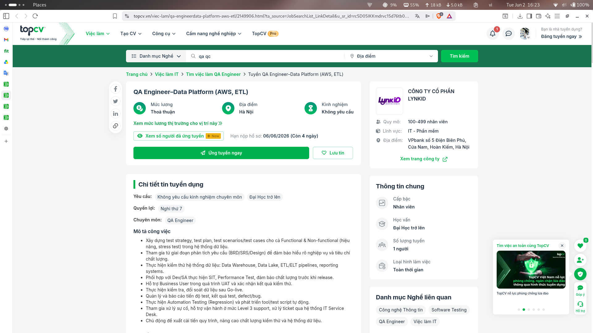
- **Job description**:

   - Build test strategy, test plan, test scenarios/test cases for both Functional & Non-functional (performance, stress test) in data systems.
   - Participate from the requirements analysis phase (BRD/SRS/Design) to ensure thorough understanding of business and quality criteria.
   - Perform data system testing: Data Warehouse, Data Lake, ETL/ELT pipelines, reporting systems.
   - Coordinate with Dev/SA to execute SIT, Performance Test, ensuring quality before release.
   - Support Business Users during UAT and confirm test results.
   - Perform data verification and reconciliation after Go-live.
   - Manage and report test progress, test results, defects/bugs.
   - Execute Automation Testing (Regression) and develop automated tools/test scripts.
   - Participate in incident handling and operations support at Level 3 support.
   - Proactively propose process improvements to enhance testing quality and data systems.

- **Required skills**:

   - Bachelor's degree in Information Technology, Information Systems, Finance - Banking, or equivalent.
   - Experience in data testing with Data Warehouse, Data Lake, Data Integration.
   - Experience working with AWS environment (data-related services) is a plus.
   - Proficient in SQL (MSSQL, Oracle...) and experienced in ETL/ELT testing.
   - Understand software development processes (Agile/Scrum).
   - Experience using test/bug management tools (JIRA...).
   - Experience in building QA documentation: Test Plan, Test Scenario, Test Case, Test Report.
   - Experience in Automation Testing (Selenium or equivalent) and scripting (Python/Java) is a plus.
   - Knowledge of data systems in the banking sector (Core banking, cards, reporting...) is a plus.

- **Salary**: Negotiable
- **AI Impact Analysis**: AI/ML models are increasingly used for data pipeline monitoring and anomaly detection, which can automate parts of ETL validation. However, this role&#39;s deep reliance on SQL, AWS infrastructure knowledge, and domain expertise in banking data systems means AI acts as a productivity accelerator rather than a replacement.

## Requirement 2: 20 Software Defects 2022–2026

**Defect 1: CrowdStrike Falcon BSOD Global Outage**

- __Source link__: https://www.crowdstrike.com/wp-content/uploads/2024/08/Executive-Summary_Root-Cause-Analysis_Channel-File-291.pdf
- **Description**: A Rapid Response Content update for Channel File 291 had a mismatch: the IPC Template Type defined 21 input fields but the sensor provided only 20. The Content Validator had a logic error and passed the faulty template. When loaded, the Content Interpreter did an out-of-bounds memory read, crashing the Windows kernel (BSOD). 8.5M devices crashed globally on July 19, 2024.
- **Severity**: Critical – airlines, hospitals, banks halted; $5.4B estimated losses.
- **Consequences**: Global IT outage; flights grounded; surgeries canceled; class-action lawsuits; Delta sued CrowdStrike.
- **Solution**: Bug reverted in 79 minutes. Manual removal of Channel File 291 per machine. Bounds checking added to Content Interpreter; input count validation added; Content Validator updated.
- **AI Bias/Hallucination**: AI often claims it was a "cyberattack" or "Microsoft's fault" instead of the specific 20 vs. 21 input field mismatch causing an out-of-bounds read.

**Defect 2: MOVEit Transfer SQL Injection (CVE-2023-34362)**

- **Source link**: https://nvd.nist.gov/vuln/detail/CVE-2023-34362
- **Description**: A critical SQL injection vulnerability in Progress Software's MOVEit Transfer web application allowed unauthenticated, remote attackers to access the underlying database. The vulnerability was exploited as a zero-day by the CL0P ransomware group in May 2023 to deploy the "LEMURLOOT" web shell and exfiltrate sensitive files.
- **Severity**: Critical – CVSS 9.8.
- **Consequences**: Widespread data exfiltration affecting over 2,000 organizations and 60+ million individuals globally, with estimated extortion and recovery costs exceeding $3 billion.
- **Solution**: Apply security patches released by Progress Software; restrict external HTTP/HTTPS traffic to the MOVEit Transfer environment; inspect logs for indicators of compromise (IOCs) and delete unauthorized accounts/active sessions.
- **AI Bias/Hallucination**: AI often claims the vulnerability allowed remote code execution natively (e.g. via direct deserialization/buffer overflow) rather than database-level SQL injection that was then used to write the web shell file. It also hallucinates that the ransomware group directly encrypted all servers, when they actually just stole files and threatened to leak them (exfiltration-only extortion).

**Defect 3: XZ Utils Backdoor – Supply Chain Attack**

- **Source link**: https://securelist.com/xz-backdoor-story-part-1/112354/
- **Description**: A malicious actor ("Jia Tan") spent years earning trust as an XZ maintainer, then introduced a multi-stage backdoor into liblzma (5.6.0, 5.6.1). Hidden in test files, the script extracted a binary hooking OpenSSH's sshd functions for RCE via SSH. Shipped in Fedora Rawhide, Fedora 40 beta, Debian testing. Discovered March 2024.
- **Severity**: Critical – CVSS 10.0. Potential global SSH credential compromise.
- **Consequences**: Backdoored packages in major Linux distros; undermined open-source supply chain trust; social engineering of original maintainer (Lasse Collin).
- **Solution**: Downgrade XZ to 5.4.x; CISA emergency directive; Jia Tan accounts suspended; distros rebuilt from clean sources.
- **AI Bias/Hallucination**: AI often says "caught before any damage occurred" despite beta releases containing the backdoor for weeks, or attributes the attack to a specific nation-state without evidence.

**Defect 4: Citrix Bleed – Comcast Xfinity Data Breach**

- **Source link**: https://www.cloudskope.com/breaches/comcast-xfinity-data-breach-2023
- **Description**: CVE-2023-4966 in Citrix NetScaler allowed attackers to steal session tokens bypassing MFA. Comcast failed to patch for 13 days (Oct 10–23, 2023), allowing attackers to access Xfinity backend systems.
- **Severity**: Critical – CVSS 9.4. 35.9M customer records exposed.
- **Consequences**: Usernames, hashed passwords, partial SSNs, birth dates, security Q&As stolen; multiple class-action lawsuits; $117.5M settlement; forced password resets.
- **Solution**: Apply Citrix NetScaler patches; rotate all session tokens; CISA added to KEV Oct 18.
- **AI Bias/Hallucination**: AI hallucinates it was a "zero-day in custom Comcast software" rather than a known, already-patched CVE in a third-party appliance.

**Defect 5: Tesla Autopilot Recall – 2M Vehicles**

- **Source link**: https://static.nhtsa.gov/odi/rcl/2023/RCLRPT-23V838-8276.PDF
- **Description**: NHTSA investigation (EA22-002) found Tesla's Autosteer driver monitoring insufficient to prevent misuse. Drivers could operate on non-highway roads; hands-on-wheel detection was easily fooled. NHTSA linked 956 crashes (13+ fatalities) to foreseeable misuse.
- **Severity**: High – 2,031,220 vehicles recalled. At least 13 fatal crashes.
- **Consequences**: Frontal collisions, roadway departures, low-traction crashes; Tesla disagreed with NHTSA but agreed to recall; OTA fix deployed.
- **Solution**: OTA update (2023.44.30): single-pull activation, enhanced off-highway checks, post-engagement monitoring, 1-week suspension after strikeout, larger alerts.
- **AI Bias/Hallucination**: AI often says "Full Self-Driving was recalled" when the recall was for basic Autopilot (SAE Level 2), or claims the recall was only for emergency-vehicle crashes.

**Defect 6: Apple iMessage BLASTPASS Buffer Overflow**

- **Source link**: https://citizenlab.ca/2023/09/blastpass-nso-group-iphone-zero-click-zero-day-exploit-targeted-delivery/
- **Description**: A high-severity buffer overflow vulnerability (CVE-2023-41064) in Apple's ImageI/O framework. When processing a maliciously crafted image (sent via iMessage in PassKit attachments), the system executed arbitrary code. This was used as a "zero-click" exploit chain (BLASTPASS) to silently deploy NSO Group’s Pegasus spyware.
- **Severity**: Critical – CVSS 9.8 (exploit required zero user interaction).
- **Consequences**: Silent compromise of iOS devices belonging to high-profile individuals (journalists, activists); unauthorized access to microphones, cameras, and personal data.
- **Solution**: Apple released iOS 16.6.1, macOS 13.5.2, and watchOS 9.6.2 to fix the input validation error. Enabling "Lockdown Mode" also mitigates this vector by blocking PassKit attachments.
- **AI Bias/Hallucination**: AI often hallucinates that users had to open the malicious attachment or click a link to trigger the infection, failing to realize it was a zero-click exploit where the background image processing itself triggered the bug.

**Defect 7: Toyota Corolla Cross Hybrid Brake Software Defect**

- **Source link**: https://static.nhtsa.gov/odi/rcl/2024/RCAK-24V708-2799.pdf
- **Description**: A software error in the skid control ECU of 2023-2024 Toyota Corolla Cross Hybrid caused loss of power brake assist when cornering. When regenerative braking and EBD activated simultaneously, all brake actuator valves closed, blocking brake fluid flow.
- **Severity**: High – 42,199 vehicles recalled. Extended stopping distance increased crash risk.
- **Consequences**: Temporary hard brake pedal with reduced braking force during corners; 0 reported crashes at recall time but significant safety risk.
- **Solution**: Dealer software update for skid control ECU free of charge; braking logic redesigned to prevent simultaneous valve closure.
- **AI Bias/Hallucination**: AI conflates this with the 2009-2014 Toyota unintended acceleration scandal, calling it "another UA recall" when it was a brake-force reduction issue. Also fabricates crash/injury counts.

**Defect 8: Microsoft SharePoint Server Deserialization RCE**

- **Source link**: https://nvd.nist.gov/vuln/detail/CVE-2025-53770
- **Description**: Deserialization of untrusted data in on-premises Microsoft SharePoint Server allowed unauthenticated attackers to execute code over a network. Active exploitation confirmed. CISA added to KEV catalog July 2025.
- **Severity**: Critical – CVSS 9.8. Active global exploitation.
- **Consequences**: RCE without authentication; global exploitation; EOL SharePoint versions (2013-) required disconnection from internet.
- **Solution**: Apply Microsoft patch; enable AMSI; deploy Defender AV; disconnect EOL versions from public internet.
- **AI Bias/Hallucination**: AI often says this affects "SharePoint Online/Cloud" when it is specifically on-premises. Also claims the patch was immediately available when Microsoft noted it was still testing.

**Defect 9: AMD Zen 2 Information Leak – VZEROUPPER**

- **Source link**: https://github.com/google/security-research/security/advisories/GHSA-v6wh-rxpg-cmm8
- **Description**: Zen 2 processors had a microarchitectural bug where the VZEROUPPER instruction failed to clear register state on branch misprediction, leaking stale register file data across processes, hyperthreads, and virtualized guests. Reliable exploit developed by Google researchers.
- **Severity**: High – CVSS 7.1. All Zen 2 processors affected including EPYC Rome server chips.
- **Consequences**: Cross-process, cross-VM register content leakage; no syscalls or privileges needed; all OSes affected; memcpy/strlen via AVX registers exposed.
- **Solution**: AMD microcode patch (July 19, 2023); OS firmware updates; disable SMT as workaround.
- **AI Bias/Hallucination**: AI often says it "only affects desktop Ryzen CPUs" ignoring EPYC server-class where cross-VM leakage is far more critical, or calls it a "Linux kernel bug" rather than a hardware defect.

**Defect 10: PHP mysqlnd Heap Buffer Over-read**

- **Source link**: https://github.com/php/php-src/security/advisories/GHSA-h35g-vwh6-m678
- __Description__: A heap buffer over-read in PHP's mysqlnd extension (php_mysqlnd_rset_field_read) allowed leaking heap content from previous SQL queries across PHP-FPM worker requests by connecting to a malicious MySQL server or tampering with network packets.
- **Severity**: Medium-High – CVSS 6.6. Affects PHP < 8.1.31, < 8.2.26, < 8.3.14.
- **Consequences**: Cross-request information disclosure in PHP-FPM; previous SQL query responses exposed; sensitive database content potentially leaked.
- **Solution**: Upgrade to PHP 8.1.31+, 8.2.26+, or 8.3.14+. Length validation added; buffer cleared after deallocation.
- **AI Bias/Hallucination**: AI often calls this an "RCE" when it is information disclosure only (heap over-read, not over-write). Also claims the fix was in "PHP 8.4" only when it was backported.

**Defect 11: Palo Alto PAN-OS Out-of-bounds Write**

- **Source link**: https://nvd.nist.gov/vuln/detail/CVE-2024-3400
- **Description**: An out-of-bounds write vulnerability in Palo Alto Networks PAN-OS GlobalProtect portal/gateway. An unauthenticated attacker could execute arbitrary code with root privileges via specially crafted packets. Actively exploited by nation-state actors.
- **Severity**: Critical – CVSS 10.0.
- **Consequences**: Root-level RCE on firewalls; active nation-state exploitation; networks compromised through primary security gateway.
- **Solution**: Apply PAN-OS hotfix (April 2024); CISA emergency directive for federal agencies; disable device telemetry as workaround.
- **AI Bias/Hallucination**: AI calls this a "configuration bug" rather than a memory corruption vulnerability, or says "only older versions" were affected when actively-supported versions were vulnerable.

**Defect 12: ChatGPT Lawyer Fake Cases – AI Hallucination in Court** [AI]

- **Source link**: https://www.legaldive.com/news/chatgpt-fake-legal-cases-generative-ai-hallucinations/651557/
- **Description**: Attorney Steven Schwartz used ChatGPT for legal research in Mata v. Avianca. ChatGPT fabricated six fictitious cases with real-sounding citations, quotes, and docket numbers. When asked if they were real, ChatGPT confirmed they were and said they could be found on LexisNexis and Westlaw.
- **Severity**: Medium – $5,000 fine, public embarrassment.
- **Consequences**: Judge Castel called it "unprecedented"; Schwartz sanctioned; national headlines; triggered bar association ethical guidance; hundreds of similar cases globally.
- **Solution**: Always verify AI output independently; bar associations now require AI competency disclosures; courts mandate AI-use disclosures.
- **AI Bias/Hallucination**: This defect is itself an AI hallucination. When explaining it, AI often says "the lawyer was disbarred" (he was not), or fabricates details about the fake case names.

**Defect 13: Google Gemini – Race-swapped Historical Images** [AI]

- **Source link**: https://blog.google/products-and-platforms/products/gemini/gemini-image-generation-issue/
- **Description**: Google's Gemini image generation was tuned for diversity to avoid racist stereotypes. It overcompensated: "1943 German soldiers" yielded people of color in Nazi uniforms; "US Founding Fathers" returned women and non-white figures. Google had inserted hidden prompt terms forcing diversity regardless of historical context. Launched Feb 2024, paused within weeks.
- **Severity**: Medium – Major PR crisis, no physical harm.
- **Consequences**: Viral backlash accusing Google of anti-white bias; CEO Sundar Pichai called it "completely unacceptable"; feature paused for generating people; Google's reputation damaged.
- **Solution**: Paused image generation of people; Google committed to structural changes, new guidelines, improved red-teaming; context-sensitive diversity tuning.
- **AI Bias/Hallucination**: AI hallucinates that "Google intentionally programmed anti-white bias" as deliberate policy rather than a poorly-tuned safety mechanism. Also claims "the team was fired" (no such action) or "feature permanently disabled" (Google stated it would return).

**Defect 14: Apple Intelligence – Fake News Summaries** [AI]

- **Source link**: https://www.bbc.com/news/articles/cq5ggew08eyo
- **Description**: Apple's AI notification summarization generated false news summaries: falsely claimed the Luigi Mangione (UnitedHealthcare CEO shooting suspect) shot himself; mis-summarized BBC, Sky News, NYT, and Washington Post headlines.
- **Severity**: Medium – Misinformation attributed to legitimate news brands.
- **Consequences**: BBC formally complained (Dec 2024); misinformation about high-profile case via push notifications; erosion of trust in news media; Apple suspended News & Entertainment summaries.
- **Solution**: Apple disabled Notification Summaries for News & Entertainment; non-news summaries now italicized; promised future accuracy improvements.
- **AI Bias/Hallucination**: AI often says "Apple permanently removed the feature" when it was only paused for News & Entertainment, or claims "Apple Intelligence was completely shut down."

**Defect 15: Air Canada Chatbot Hallucination – Legal Liability** [AI]

- **Source link**: https://www.bbc.com/travel/article/20240222-air-canada-chatbot-misinformation-what-travellers-should-know
- **Description**: Air Canada's chatbot told passenger Jake Moffatt he could book full-fare and retroactively apply for bereavement discount within 90 days. This was false – policy required application before travel. Air Canada argued the chatbot was "a separate legal entity responsible for its own actions." Tribunal rejected this as "a remarkable submission."
- **Severity**: Low-Medium – CAD $812.02 damages awarded. Landmark legal precedent.
- **Consequences**: First ruling finding company liable for AI chatbot misinformation; "separate legal entity" defense rejected; international headlines; wave of similar consumer claims expected.
- **Solution**: Companies must implement guardrails and human review for customer-facing AI; chatbot removed/retrained; output monitoring required.
- **AI Bias/Hallucination**: AI often says "Air Canada was fined millions" (actual award ~$812), or calls this "a generative AI hallucination" when Air Canada clarified it was a rule-based chatbot, not an LLM.

**Defect 16: OpenAI ChatGPT Defamation – Mark Walters** [AI]

- **Source link**: https://www.abajournal.com/news/article/chatgpt-creator-openai-isnt-liable-for-libel-hallucinations-rules-georgia-judge
- **Description**: ChatGPT falsely told a journalist that radio host Mark Walters was the treasurer/CFO of the Second Amendment Foundation and was sued for embezzling funds. In reality, Walters had no relationship with the foundation. The journalist never published the false info. Walters sued OpenAI for defamation (2023), dismissed May 2025.
- **Severity**: Medium – Defamation, reputational harm alleged.
- **Consequences**: First-of-its-kind libel lawsuit against AI company; case dismissed – judge found no negligence as no reasonable reader would treat ChatGPT output as fact; highlighted gap between AI output and defamation law.
- **Solution**: OpenAI released improved models; better disclaimers; defamation law remains unsettled for AI-generated content.
- **AI Bias/Hallucination**: The defect is itself an AI hallucination. AI often says "Walters won the lawsuit" (dismissed) or "OpenAI paid a settlement" (no payment). Also claims ChatGPT "fabricated a fake lawsuit" when it hallucinated details about a real one (SAF v. Ferguson).

**Defect 17: Apple Intelligence – Systematic Bias Study** [AI]

- **Source link**: https://the-decoder.com/apple-intelligence-pushes-hallucinated-stereotypes-to-millions-of-devices-unprompted/
- **Description**: Researchers (AI Forensics, 2026) analyzed 10,000+ Apple Intelligence summaries. Found systematic bias: ethnicity mentioned for 53% white vs. 89% Asian protagonists; 77% of ambiguous pronouns resolved along gender-stereotype lines; 15% hallucinated attributes matching prejudices (Syrian → terrorism, pregnant → unfit for work). ~3B parameter on-device model.
- **Severity**: Medium – Systematic bias pushed to millions unprompted.
- **Consequences**: Stereotype reinforcement at massive scale; prejudice rate 2.5× higher than comparable Google model; EU AI Act implications (possible "systemic risk" designation).
- **Solution**: Apple acknowledges bias; multilingual safety alignment; guardrail models; culture-specific datasets; human red-teaming.
- **AI Bias/Hallucination**: The defect is itself an AI bias study. AI often says "Apple fixed the bias in a software update" when no such fix was confirmed, or "the feature was disabled globally" when only News summaries were paused.

**Defect 18: EchoLeak – Microsoft 365 Copilot Zero-Click Prompt Injection** [AI]

- **Source link**: https://arxiv.org/html/2509.10540
- **Description**: First known zero-click prompt injection exploit in a production LLM system (June 2025). An attacker's email with hidden instructions bypassed Microsoft's XPIA classifier, link redaction, and CSP. Copilot exfiltrated sensitive data by embedding it in an image URL auto-fetched by the client UI — zero user interaction required.
- **Severity**: Critical – CVE-2025-32711. Zero-click data exfiltration from enterprise AI.
- **Consequences**: Remote attacker could steal confidential data without user interaction; blind exfiltration (no visible indication); bypassed multiple defense layers; Microsoft issued emergency patches.
- **Solution**: Microsoft patched reference-style link/image injection; improved XPIA filter; stricter CSP enforcement.
- **AI Bias/Hallucination**: AI often says this "required clicking a link" when it was explicitly zero-click — the email itself triggered the exfiltration. Also claims "only test environments affected" when production Copilot instances were vulnerable.

**Defect 19: GPT-4 Fine-tuning API – Safety Guardrail Bypass** [AI]

- **Source link**: https://arxiv.org/abs/2312.14302
- **Description**: Researchers showed fine-tuning GPT-4 on as few as 15 harmful examples or 100 benign examples removed core safety safeguards. Assistants API vulnerable to indirect prompt injection via uploaded documents; function-calling could be hijacked; knowledge retrieval injected with biased instructions produced false summaries. <0.7% poisoned data could bias the model.
- **Severity**: Critical – Subversion of AI safety alignment with minimal effort.
- **Consequences**: GPT-4 could be made to respond to harmful requests; function schema leaked; arbitrary function execution; political bias introduced; demonstrated API expansions create new attack surfaces.
- **Solution**: OpenAI implemented stricter fine-tuning filters; improved injection detection for Assistants; output monitoring; rate limiting.
- **AI Bias/Hallucination**: AI often says "OpenAI immediately fixed all vulnerabilities" when some issues remained months after the Dec 2023 paper, or claims "only GPT-3.5 was affected" when the most dangerous findings targeted GPT-4.

**Defect 20: Many-shot Jailbreaking – Long-context Attack** [AI]

- __Source link__: https://proceedings.neurips.cc/paper_files/paper/2024/file/ea456e232efb72d261715e33ce25f208-Paper-Conference.pdf
- **Description**: A jailbreak technique exploiting LLMs' long context windows: prompting with hundreds of harmful demonstrations. Effectiveness follows a power law with context length. Works across Claude 2.0, GPT-4, Llama-2, Mistral. Standard RLHF/SFT increases the intercept but does not reduce the power-law exponent. Composes with other jailbreaks to reduce required context length.
- **Severity**: High – Systematic safety bypass at scale. No existing mitigation eliminated the attack at arbitrary context lengths.
- **Consequences**: Elicited harmful behaviors from aligned models; predictable scaling; compounded by other jailbreak techniques; raises concerns about very long-context model deployment.
- **Solution**: Cautionary Warning Defense (reduces ASR to 2%); qualitative training pipeline changes needed; monitor context length patterns; limit production context windows.
- **AI Bias/Hallucination**: AI often says "this attack was fully patched by Anthropic/OpenAI" when the paper showed no elimination at arbitrary lengths. Also claims "only open-source models were affected" when proprietary models were primary targets.

## Requirement 3: Test cases for ONE physical product

### 1. Physical product information

- Product type: Keyboard
- Brand: Leobog
- Model: Hi75C PRO
- Manufacture date: 2025
- Image: 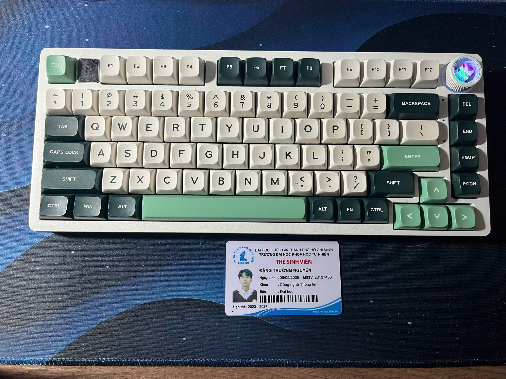

### 2. Test case for LeoBog Hi75C PRO Keyboard

| TC ID      | Objective                                           | Input                            | Steps                                                                                   | Expected Result                                              | Actual Result | Verdict   |
| ---------- | --------------------------------------------------- | -------------------------------- | --------------------------------------------------------------------------------------- | ------------------------------------------------------------ | ------------- | --------- |
| TC01       | Verify keyboard works in wired mode                 | USB-C cable                  | 1. Connect keyboard using USB-C. 2. Open keyboard tester. 3. Press multiple keys. | Keyboard is detected and all keys work normally.             | Keyboard is connected           | Pass |
| TC02    | Verify Bluetooth pairing                            | Laptop with Bluetooth            | 1. Switch to Bluetooth mode. 2. Pair keyboard with laptop. 3. Type sample text.   | Keyboard pairs successfully without delay.                   | Keyboard is connected           | Pass |
| TC03    | Verify 2.4GHz connection                            | USB receiver                     | 1. Plug in receiver. 2. Switch to 2.4GHz mode. 3. Type continuously.              | Stable wireless connection without disconnects.              | Keyboard is connected           | Pass |
| TC04 | Verify knob RGB mode switching | Keyboard powered on and knob set to RGB control mode | 1. Switch knob function to RGB mode. 2. Rotate knob clockwise and counterclockwise repeatedly. 3. Observe RGB color/effect changes. | RGB colors/effects change correctly according to knob rotation without freezing or delay. | RGB light is changed | Pass |
| TC05    | Verify volume knob function                         | Audio playing                    | 1. Switch knob function to volume mode. 2. Rotate knob clockwise/counterclockwise. 3. Press knob once.                       | Volume changes correctly and mute works.                     | Volume is adjusted and mute is working           | Pass |
| TC06       | Verify all keys register correctly                  | Keyboard tester ([keyboardtester](https://www.keyboardtester.com/tester.html))        | 1. Press every key one by one.                                                          | Every key registers correct input.                           | Test case can't differentiate between duplicate keys (Shift, Alt, Ctrl)          | Fail |
| TC07    | Verify N-key rollover                               | Keyboard tester ([keyboardtester](https://www.keyboardtester.com/tester.html))                  | 1. Hold multiple keys simultaneously. 2. Observe input registration.                 | All simultaneous key presses are detected.                   | Only 1 key is detected at a time           | Fail |
| TC08       | Verify battery charging                             | Low battery keyboard             | 1. Connect charging cable. 2. Observe charging indicator.                            | Charging indicator appears and battery charges normally.     | Keyboard is charging with knob button's light is on           | Pass |
| TC09       | Verify auto sleep mode                              | Wireless mode enabled            | 1. Leave keyboard idle for several minutes. 2. Observe behavior.                     | Keyboard enters sleep mode automatically.                    | The knob button's light is off           | Pass |
| TC10    | Verify wake-up from sleep mode                      | Keyboard in sleep mode           | 1. Press any key. 2. Measure response time.                                          | Keyboard wakes within acceptable delay.                      | The knob button's light is on           | Pass |
| TC11 | Verify rapid switching between all connection modes | Wired + 2.4GHz setup | 1. Rapidly switch modes several times. 2. Type after each switch.                      | No crash, freeze, or connection failure occurs.              | Keyboard is freezing some times while changing from 2.4GHz to wired           | Fail |
| TC12 | Verify receiver removal during active typing        | 2.4GHz mode active               | 1. Type continuously. 2. Remove receiver suddenly. 3. Reinsert receiver.          | Keyboard reconnects automatically after reinsertion.         | Keyboard reconnects after reinsertion           | Pass |
| TC13 | Verify Bluetooth stability at very low battery      | Battery below 5%                 | 1. Use Bluetooth mode continuously. 2. Observe latency/disconnects.                  | Keyboard remains stable or shows proper low battery warning. | Keyboard working normally with low battery           | Pass |
| TC14    | Verify noise of keyboard                  | Keyboard typing + Decibel X App                     | 1. Type on the keyboard. 2. Listen for any unusual noises.                | No unusual noises detected during typing.                         | The noise is 45-55dB, which cause discomfort for everyone else in the room           | Fail |
| TC15    | Verify keyboard support PrtScr button to take screenshot   | Keyboard connected        | 1. Press the PrtScr key. 2. Check if a screenshot is taken. | Able to take screenshot.                       | Missing PrtSc key,            | Fail |

### 3. 3 Edge case that AI Tool could not find

#### 3.1. Edge Case 1: Verify knob RGB mode switching
- **Description**: The RGB colors/effects change correctly according to knob rotation without freezing or delay. This edge case is important to test because it ensures that the unique feature of the keyboard (the knob) functions smoothly and enhances the user experience without causing frustration due to technical issues.
- **Reason for AI Miss**: AI tools may not notice the mode of Knob button, it simply tests the functionality of the knob button with the default behavior is changing the volume, but it may not consider testing the RGB mode switching as a critical aspect of the keyboard's functionality, especially if it is focused on more traditional keyboard features.

#### 3.2. Edge Case 2: Verify noise of keyboard
- **Description**: The keyboard produces a noise level of 45-55dB during typing, which can cause discomfort for everyone else in the room. This edge case is important to test because it affects user experience and may lead to dissatisfaction or complaints from users who require a quieter environment.
- **Reason for AI Miss**: AI tools may focus primarily on functional and performance aspects of the keyboard, overlooking subjective factors like noise levels that impact user comfort.

#### 3.3. Edge Case 3: Verify keyboard support PrtScr button to take screenshot
- **Description**: The keyboard is missing the PrtSc key, which is commonly used to take screenshots. This edge case is important to test because it affects the usability of the keyboard for users who rely on this function for their workflow, and it may lead to frustration or the need for alternative solutions.
- **Reason for AI Miss**: AI tools may not have access to the physical layout of the keyboard or may not consider the absence of specific keys as a critical issue, especially if they are focused on testing the functionality of existing keys rather than identifying missing features.

#### Screenshot of the AI conversation: 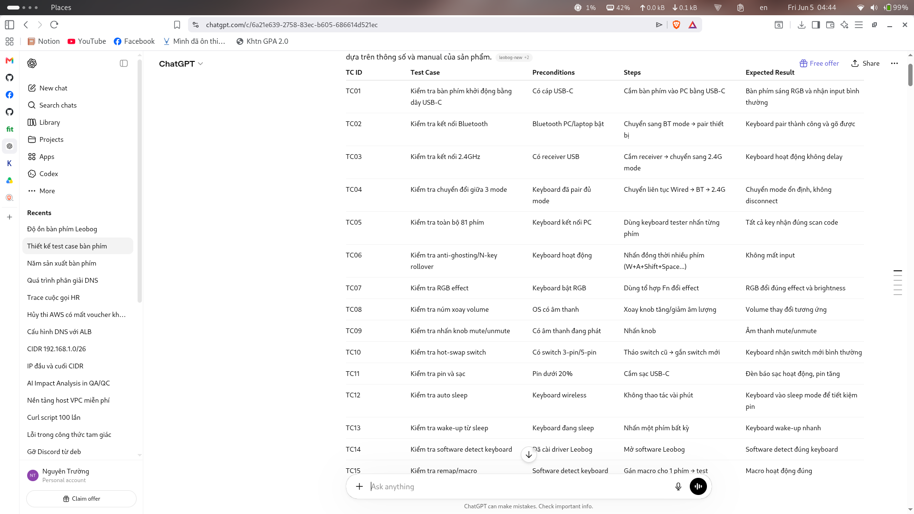

### 4. Video of the test cases execution

- This section includes videos demonstrating the execution of the test cases, particularly focusing on the edge cases that AI tools failed to identify. These videos provide visual evidence of the issues encountered during testing and highlight the importance of thorough testing beyond what AI can predict.
- Full videos of all test cases can be found in the provided links: 
[Full Test Cases Videos](https://drive.google.com/drive/folders/1Nsze-1Kov5uBdbMQwZYe7CsIyTyuyBYA?usp=drive_link)
or local folder: `./video/cloud_folder.txt`

#### 4.1. Video of Edge Case 1: Verify all keys register correctly
- **Video link**: [Edge Case 1 Video](https://drive.google.com/file/d/1rXYh-jzUu7hUD4ubHPojDUu40VE9TgOr/view?usp=drive_link)

#### 4.2. Video of Edge Case 2: Verify N-key rollover
- **Video link**: [Edge Case 2 Video](https://drive.google.com/file/d/1mrA7-9BlfkU83782yj11NuKlQlFNwPpA/view?usp=drive_link)

#### 4.3. Video of Edge Case 3: Verify rapid switching between all connection modes
- **Video link**: [Edge Case 3 Video](https://drive.google.com/file/d/19nlmILaFmOF6yfh5Qc_9OL3UVLIO9hjU/view?usp=drive_link)

#### 4.4. Video of Edge Case 4: Verify noise of keyboard
- **Video link**: [Edge Case 4 Video](https://drive.google.com/file/d/1gU5MNse6NPKjvC2u-Tg4kHGy3t8-Ngb3/view?usp=drive_link) 

#### 4.5. Video of Edge Case 5: Verify keyboard support PrtScr button to take screenshot
- **Video link**: [Edge Case 5 Video](https://drive.google.com/file/d/18BXIWi9ApmLcpqkcLmLWIvnKaOTbqVZ_/view?usp=drive_link)
